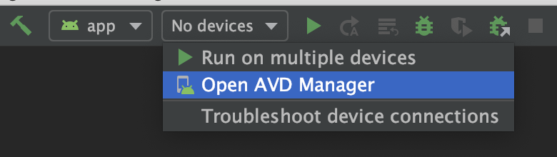
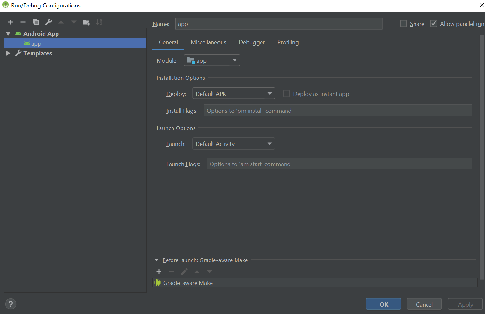
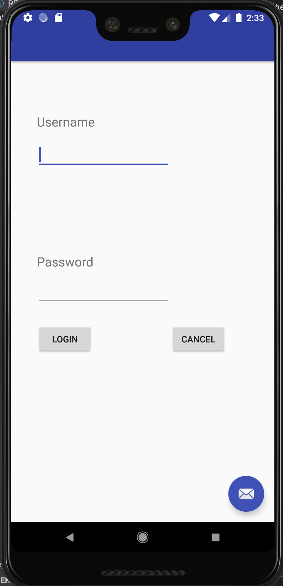
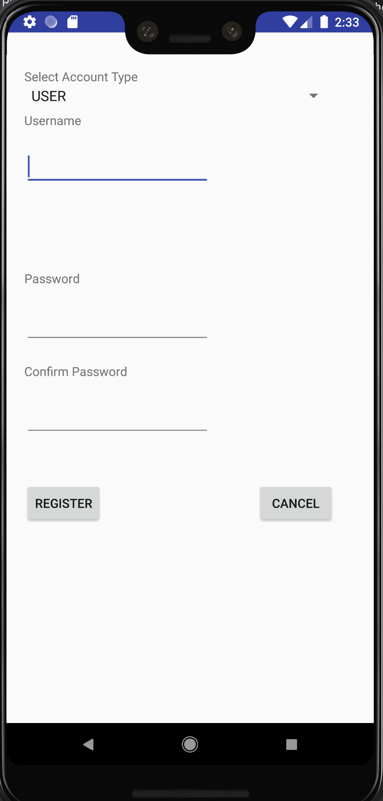
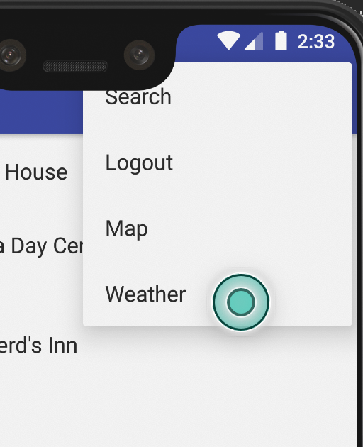
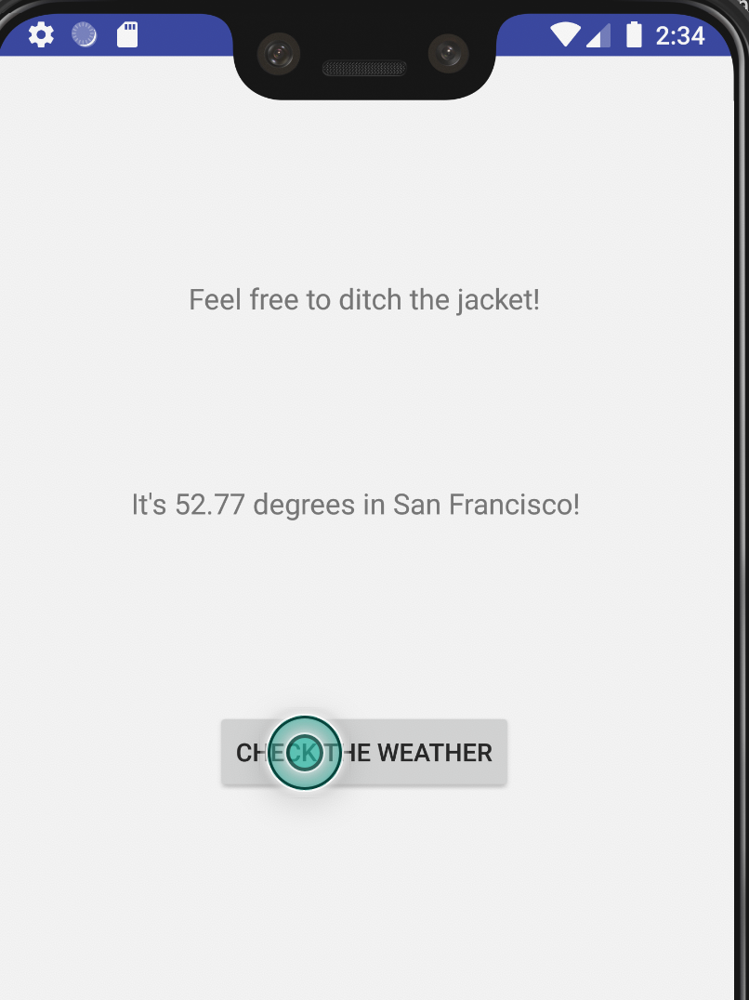

# First Assignment - Shelter Search
This sample application was create for CS 4731

## Pre-requisite Items to Install

### Android Studio
Install Android Studio from the link below  
https://developer.android.com/studio

Open an existing project with the root of this folder `Individual-Assignment`.

If the automatic build fails, it might be because you are missing Android SDK 26 and 26 Build-Tools, follow the prompted solutions in Android Studio and get those packages installed.

#### Virtual Device
Once is built, you will need to create a new virtual device.

Be sure to create a new Anroid Emulated Device running Oreo 8.1!

#### Run
Create a new configuration using the following

From here you can start up the emulator and it should have the app running in the emulator

### AWS Setup

The API and Lambda should have already been deployed. However if for some reason you want to deploy your own or need to re-deploy...

The `deployDress.zip` contains the source code for the lambda that the mobile application hits when determining how to dress based on current whether conditions.

Follow this guide and ignore the Lambda creation part for determining how to setup an API linked to a Lambda on AWS
https://www.youtube.com/watch?v=4_WI8ZGIcXY

## Running the App

When you first open the app, you will be prompted with a login page. If this is your first time opening the app, be sure to register as a new user.

And once you are logged in, navigate to the menu at the top right. Click on the `weather` tab. Click on the `Check the weather` button to get your suggestion!

